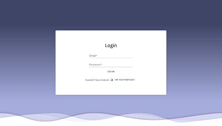
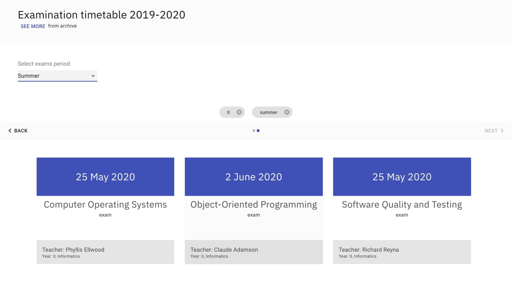
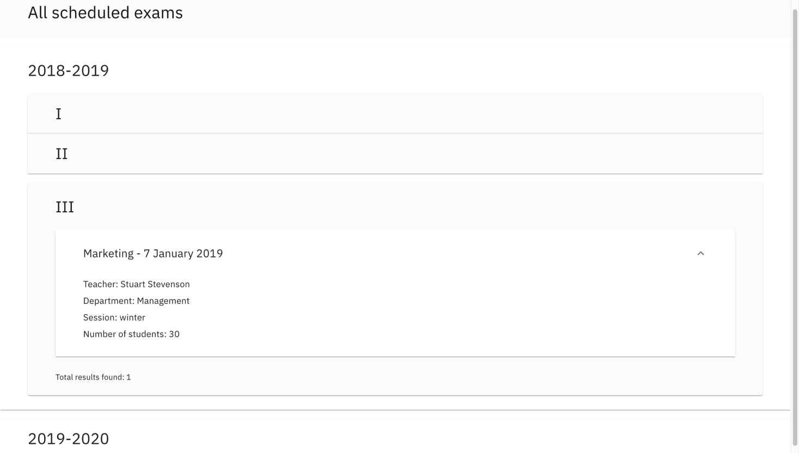
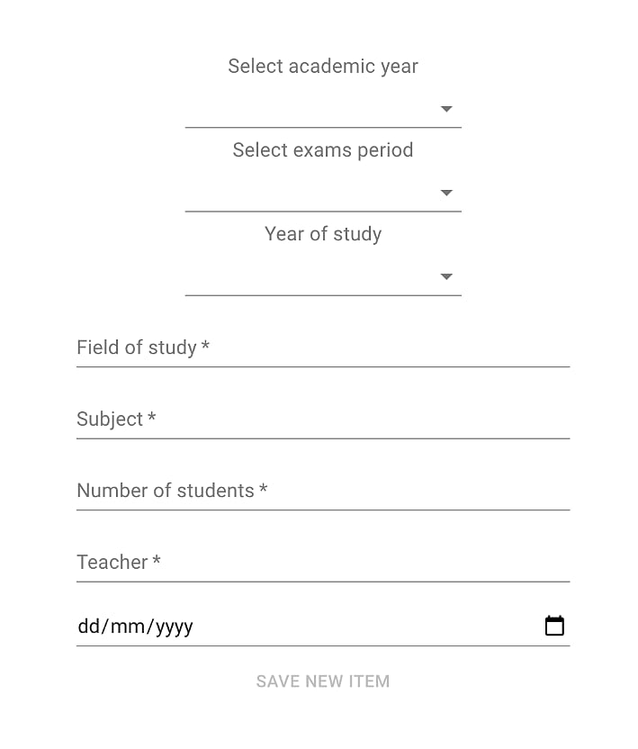
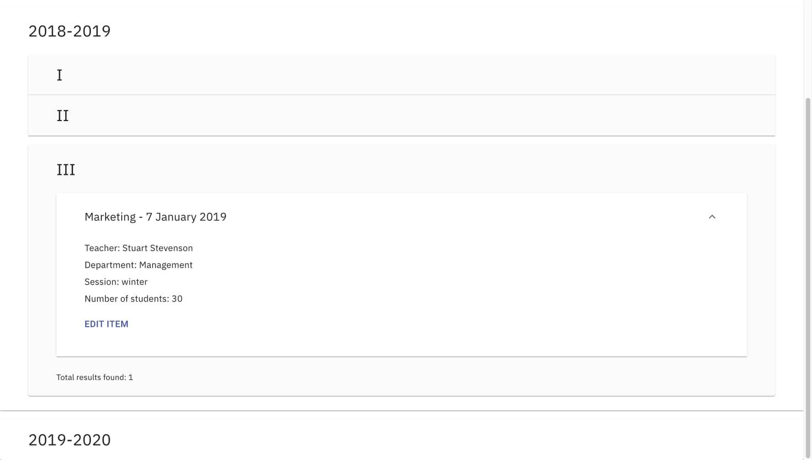
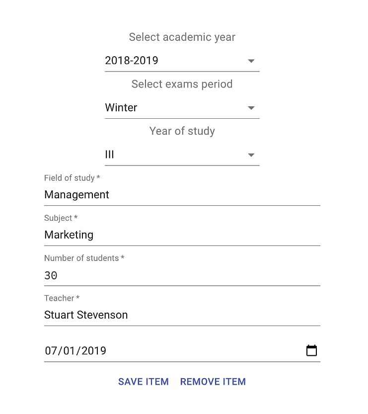

# ExamsSchedule

CRUD application that allows the management of university exams

## Development

The application is also live [HERE](https://reactproject-df131.web.app/). 
This project was created using [React.js](https://reactjs.org/), [axios](https://www.npmjs.com/package/axios), [Redux](https://redux.js.org/) and [Sass](https://sass-lang.com/) 
For database used to store the data is [Firebase Realtime Database](https://firebase.google.com/products/realtime-database). 

## Screenshots
* General access
    * Homepage 
    
    * Exams 
    
    * Archive 
    
* Users with general account access
    * Add exams 
    
    * Edit exams 
    
    * Edit/Remove exams 
    